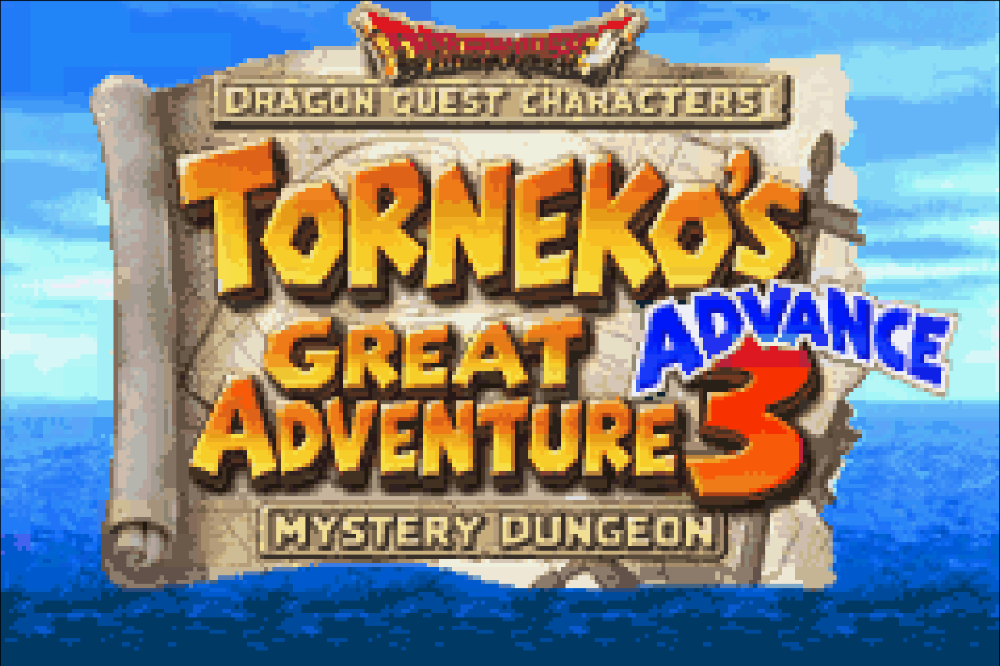
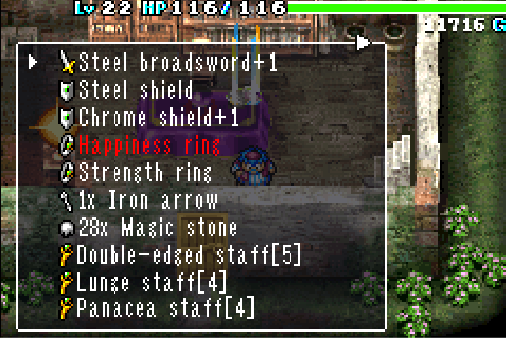
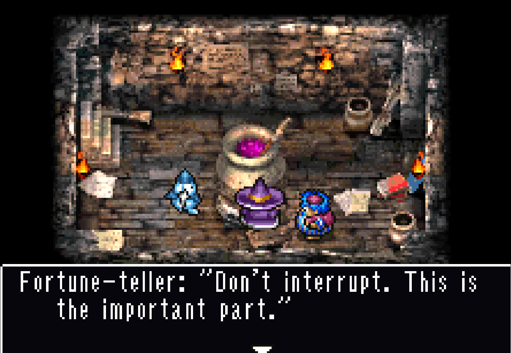
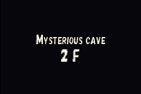

# Torneko 3 Advance — English translation

**Made with AI assistance.** An unofficial English localization of
*Dragon Quest Characters: Torneko no Daibouken 3 Advance — Fushigi no Dungeon*
for Game Boy Advance.

## Screenshots

| English title | Inventory |
|---|---|
|  |  |
| **Dialogue** | **Dungeon arrival** |
|  |  |

## Project status

The verified text inventory, prose review, approved English title and known
arrival cards are implemented. Playtesting and fixes continue. **30 drafts and
one unresolved Japanese phrase remain uninserted**; extraction completeness and
full-game runtime coverage are not yet proven.

See [current status and remaining work](docs/PROJECT_STATUS.md).

## Setup

Use the project's Python 3.11 environment, native mGBA bindings and local tools.
You need your own matching Japanese ROM. The partial fan translation is a
technical reference only, not the build base or English source.

[Installation](docs/INSTALL.md) · [Tool choices](docs/TOOLING.md)

## Build and play

From the project root:

```sh
./build.sh
```

| Output | Use |
|---|---|
| `build/torneko-3-english.gba` | Open in your GBA emulator |
| `build/torneko-3-english.bps` | Apply to the clean Japanese ROM |
| `build/torneko-3-english.json` | Build ID, hashes and validation receipt |

The build runs native menu/combat checks and verifies the BPS before publishing.
It currently needs the prepared resources, checkpoints and test fixtures in this
workspace; it cannot bootstrap an empty `build/` directory.

[Build requirements, patching and checks](docs/BUILD.md)

## Translate and revise

Review Japanese alongside the effective English:

```sh
.venv/bin/python -m tools.prose_review show core-gameplay 0 20
```

Follow the glossary, preserve controls and substitutions, and check the actual
font/layout. Historical catalogs are pinned; revisions need an owned insertion
step and fresh validation before they reach the ROM.

[Translation workflow](docs/TRANSLATING.md) · [Terminology](docs/TERMINOLOGY.md)

## Test and report bugs

Play the latest ROM. Put save states and battery saves in `saves/`; include a
screenshot, matching state, reproduction steps and build ID when reporting an
issue. Generate fresh messages when checking line wrapping—old saved history
keeps its previous layout.

[Testing guide](docs/TESTING.md) · [Playtest backlog](docs/PLAYTEST_BACKLOG.md)

## Graphics and research

[Title auditions](docs/TITLE_AUDITION.md) · [Arrival auditions](docs/ARRIVAL_AUDITION.md)
· [Credits](docs/CREDITS_AUDITION.md)

Record discoveries in the [memory map](docs/MEMORY_MAP.md) before insertion;
use the shared allocator and checked patch ownership to prevent collisions.

[Documentation index](docs/README.md) · [Uninserted drafts](docs/UNOWNED_TEXT_REVIEW.md)
