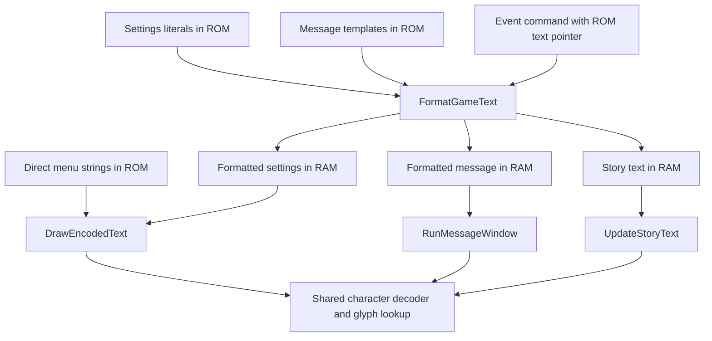

# Text-system inventory and relocation checks

Verified on 2026-09-09. **Three additional text paths can read sources relocated
into the added ROM space:** the message-speed settings row, the new-save
explanation with its `$j0` substitution, and the first opening-story page.
Their formatted output, downstream character/glyph traces, and 17 route
screenshots match the Japanese original. Created cartridge saves also match.

This milestone maps source formats and readers. It does not select a font,
translate the script, or establish complete extraction coverage. All analysis
and builds here use the Japanese original; the fan translation is not an input.

## What the inventory contains

[inventory_text.py](../tools/inventory_text.py) finds **5,244 pointer-backed
Japanese text candidates**, covering a union of **267,531 bytes**, including
terminators. Those numbers describe this scan, not the full game script or a
reliable English storage estimate. Pointer-shaped graphics data can produce
false candidates; some entries are suffixes of other strings.

The generated files are under `build/text-inventory/`:

| File | Use |
|---|---|
| `candidates.tsv` | Browse Japanese previews, ROM addresses, byte lengths, and possible pointer locations |
| `candidates.json` | Exact source bytes, lossless tokens, control bytes, and lexical placeholder matches |
| `inventory.json` | Counts, ROM-region distribution, candidate Thumb call sites, and limitations |
| `relocation/verification.json` | Verified source allocations, formatter limits, route comparisons, and hashes |
| `relocation/{original,expanded}/{settings,creation,story}/` | Screenshots, native reader traces, formatter input/output records, and routes |

The scan starts from aligned 32-bit words pointing into the original ROM's
primary cartridge view. It accepts supported NUL-terminated CP932 sequences
with at least two Japanese characters. It handles known binary control arguments
as bytes, so a coordinate such as `88` is not mistakenly decoded as a Japanese
lead byte. Unknown controls and invalid/custom encodings are rejected.

Every accepted candidate reconstructs byte-for-byte from its token `raw_hex`
fields plus its terminator. Keep those bytes authoritative: CP932 has duplicate
encodings that can map to the same Unicode character. A decode/re-encode cycle
alone is not a sufficient preservation check.

This scan can miss short or ASCII-only labels, relative or computed pointers,
compressed resources, unknown control sequences, and custom glyph codes. Its
output is an analysis inventory, not an approved translation catalog.

## Sources and pointer formats

Addresses in the next table are ROM **file offsets**.

| Source | String offset | Pointer location | Evidence |
|---|---|---|---|
| Title menu `はじめから` | `0x00C782D8` | `0x00C78280` | Direct pointer table; prior English expansion proof |
| Message-speed settings row | `0x00C40100` | `0x000785B4` | Code literal loaded at `0x080785B0`, then formatted into RAM; relocation passed |
| New-save explanation | `0x00C78444` | `0x000858F4` | Code literal loaded at `0x080858B8`; `$j0` substituted before drawing; relocation passed |
| First opening-story page | `0x0091BBB4` | `0x0091B6AC` | Absolute pointer operand in an event command; relocation passed |
| Candidate item-name table | Strings around `0x0018F734..0x00190804` | Table `0x0018F16C..0x0018F733` | Static evidence: 370 contiguous pointers; runtime use and relocation still untested |

The candidate name table contains mixed fullwidth/halfwidth Japanese,
abbreviations, and placeholders. For example, the pointer at `0x0018F5B0`
targets `薬草` at `0x0018FB48`. Do not assume that every entry is a player-visible
item name, or that these raw names are the final displayed form.

The opening-story command starts at file offset `0x0091B6A8`:

```text
27 00 00 00  B4 BB 91 08
command 0x27  pointer 0x0891BBB4
```

At instruction `0x08064E42`, the event interpreter loads that pair of 32-bit
words and advances its command cursor. The text is stored separately from the
command stream. Repointing this operand works; rewriting arbitrary pointer-like
words throughout the event data would not be justified. Other command operands
have other meanings, and the complete command grammar remains unresolved.

## Readers and the shared formatter



Function names are our analysis labels, applied by
[AnnotateTextSystems.java](../tools/ghidra_scripts/AnnotateTextSystems.java).

| GBA address | Analysis label | Observed role |
|---|---|---|
| `0x0807D8CC` | `FormatGameText` | Copies source text, handles binary controls and dollar substitutions, bounds output |
| `0x0807ADA4` | `RunMessageWindow` | Formats and displays the new-save explanation; decoder call at `0x0807AF50` |
| `0x08061200` | `ShowStoryText` | Receives the opening event's text pointer |
| `0x08061680` | `PrepareStoryText` | Formats the source into the story buffer |
| `0x08061760` | `UpdateStoryText` | Story state machine; observed decoder calls at `0x080618F4`, `0x08061A9C`, `0x08061AD2` |
| `0x08064E28` | `RunEventCommands` | Fetches the opening story's command and text pointer |
| `0x0808CAC4` | `MeasureTextLine` | Measures glyph advances until a line/end marker; observed on the naming route |

The existing `DrawEncodedText` routine at `0x0808CBA0` remains important, but
hooking only that routine misses the message-window and story paths. The shared
decoder at `0x0808C72C` and glyph drawing at `0x0808BC4C` expose those other paths.
The static scan found ten candidate Thumb calls to the decoder; not all ten have
been exercised. Code listings and provisional pseudocode are in
`text-readers-disassembly.txt` and `text-formatters-disassembly.txt`.

## Control bytes and placeholders

The source formats include two layers of commands:

- **Binary renderer controls:** sequences beginning with `03`. The settings row
  uses `03 08 xx` for horizontal positioning and `03 14 xx` to select drawing
  attributes through a lookup. Naming-keyboard text also uses `03 09 xx`.
  These argument bytes must remain separate from ordinary text.
- **Dollar commands:** `$j0` becomes the adventure-log number; on the tested route
  it becomes fullwidth `１`. The story's `$c` survives the shared formatter and
  is handled by the story renderer, whose branch centers the following line
  within 208 pixels. Other observed families include `$t`, `$i0`, `$m0`, `$d0`,
  `$p1`, `$v05`, and `$x`; their complete requirements remain to be cataloged.

There are also ordinary printf-style templates, such as
`HP %d/%d レベル%d %s` at file `0x00C783CC`. Their argument order and substituted
values need preservation independently of the dollar-command layer.

The parser currently recognizes binary subcommands `05`, `06`, `08`, `09`,
`0F`, `11`, `12`, `14`, `15`, `16`, and `1F`, with argument lengths derived from
the dispatch code. This is not a claim that every reader implements each control
identically. In particular, the direct renderer can consume a zero argument as
data, while the shared formatter's copy loop checks for NUL during control
copying. Preserve original command sequences until the relevant path is tested.

## RAM limits found on these routes

`FormatGameText` takes a source pointer in `r0`, destination in `r1`, output
payload limit address in `r2`, and line mode in the low byte of `r3`. Ordinary
output writes require `destination < limit`; the final NUL can be written at
the limit address. The limit applies **after substitutions**, including retained
formatting bytes. Code inspection shows that excess output can be discarded.

| Tested call | Destination | Limit address | Maximum payload passed to formatter | Actual payload |
|---|---|---|---:|---:|
| Settings row | `0x03007BA0` | `0x03007CA0` | 256 bytes | 40 bytes |
| New-save explanation | `0x03007900` | `0x03007CE7` | 999 bytes | 78 bytes |
| Opening story | `0x02033F54` | `0x02034353` | 1,023 bytes | 108 bytes |

Each output needs its additional NUL byte. These are the exact arguments on the
recorded routes, not universal limits for every menu or dialogue. Other buffers,
wrappers, and substitutions may impose tighter limits. The English inserter
should reject text whose worst-case expanded output exceeds its reader's budget;
more ROM space does not remove this requirement. No overflow stress test or
longer-English test was performed for these three new paths.

## Relocation proof and reproduction

[text_systems.json](../translations/proof/text_systems.json) pins the three
original strings, hashes, and pointer locations. The verifier builds a separate
32 MiB ROM with the unchanged Japanese sources at `0x09000000`, `0x0900002C`,
and `0x0900007C`. They occupy 230 payload/terminator bytes plus three alignment
bytes. Only the three specified pointer words are modified inside the original
16 MiB; the original text remains intact.

Native watchpoints observe the game's pointer loads and the formatter reading
each relocated source at instruction `0x0807DBB2`. Entry/exit breakpoints capture
formatter bounds and exact output. For each route the verifier compares those
outputs, character reads, glyph calls, and all screenshots with the original.
The creation route makes a real cartridge save; the story route boots a fresh
core with that save and displays the first two story pages. Both builds produce
the same 65,536-byte save.

```bash
.venv/bin/python -m tools.inventory_text
.venv/bin/python -m unittest discover -s tests -v
.venv/bin/python -m tools.verify_text_relocation
```

All **22 unit tests passed**, including eight new tests for encoding aliases,
control arguments, unknown controls, invalid bytes, and terminator boundaries.
The independent emulator verification passed all three routes and 17 screenshot
comparisons. Both supplied source ROMs retain their recorded hashes.

Optional standalone tracing:

```bash
.venv/bin/python -m tools.trace_text_systems
```

The tools accept an explicit Japanese ROM path as the first argument and an
`--output` directory. The proof ROM is
`build/text-inventory/relocation/torneko3-text-systems-32m.gba`, with SHA-256:

```text
57629c6cf155587e5962829f639fc89b5e847fa1260b730fce194f3da6d12225
```

This proof and the earlier English title proof are separate builds. Their
appended allocations overlap and must be coordinated by a shared allocator
before combining them.

To reproduce Ghidra inspection in the existing project, run
`InspectThumbFunctions.java` with the seven entries in the reader table, then
`AnnotateTextSystems.java`. Use the absolute project `tools/ghidra_scripts` path
for headless `-scriptPath`. The annotated project remains
`build/research/ghidra/TornekoJapanese.gpr`. Runtime evidence and assembly support
the findings; decompiler output still contains unresolved jump-table/return
warnings and is not recovered source code.

## Catalog milestone and next work

The [translation pipeline](TRANSLATION_PIPELINE.md) now turns 27 verified
menu, settings, message, and event entries into a curated catalog with stable
IDs, confirmed pointer owners, preserved controls, and per-reader output limits.
It includes a shared append-only allocator, byte-identical Japanese round trip,
font-0 bounds checks, and native English verification. The [early-menu batch](EARLY_MENUS.md)
adds default-selection markers, copied menu labels, and both-slot save/load
checks. The subsequent [name-entry proof](NAME_ENTRY.md) completes the bounded
seven-character-name pass. The [broad extraction](TEXT_EXTRACTION.md) now expands
to item/monster names, descriptions, dungeon messages, and later event sources.
It also decodes the indexed-glyph format that this earlier inventory missed.

Existing font 0 is now the selected English baseline, following the
[Latin font review](FONTS.md). Storage expansion is demonstrated across more than
the title menu, while text completeness, substitution limits, and layout coverage
still need systematic work.

The [Latin font review](FONTS.md) records the measured variants and native
English specimens behind the font choice.
